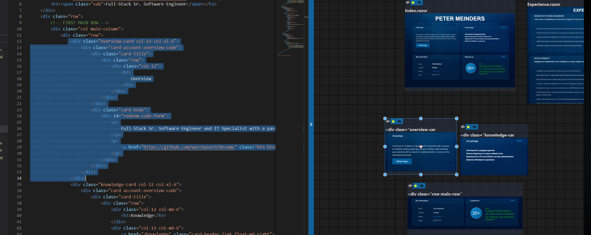
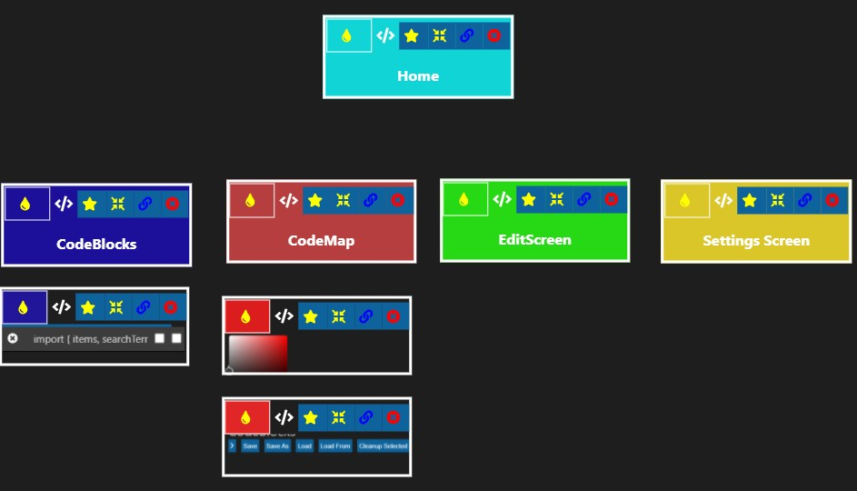
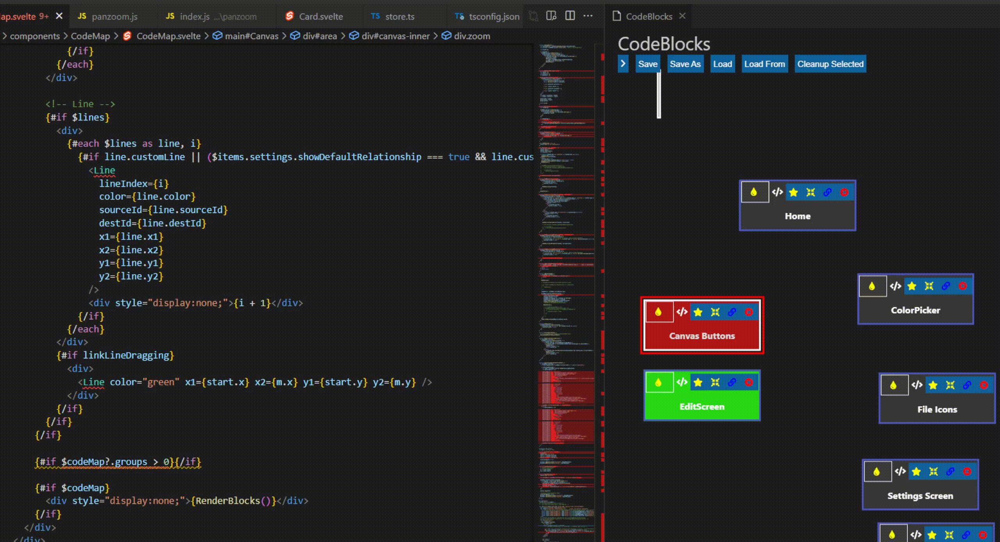
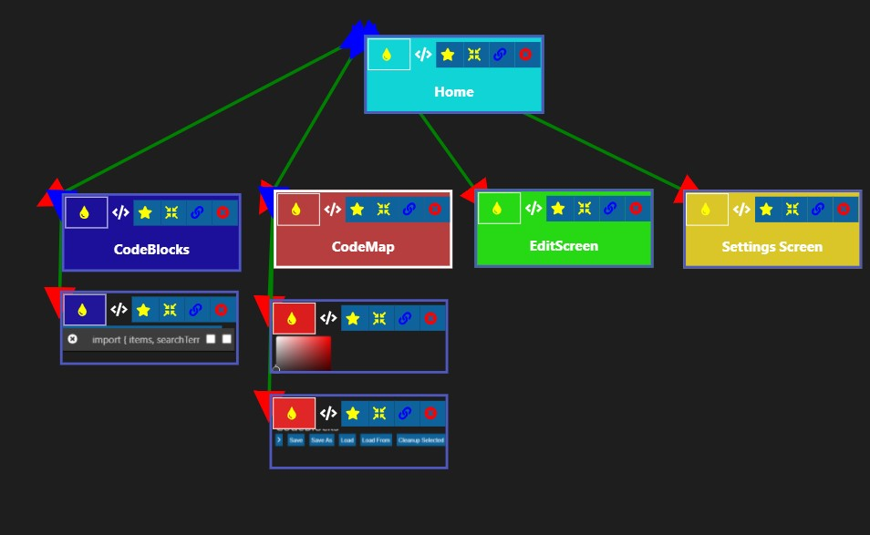

# VSCode Blocks

VSCode Blocks is an extension for building code maps from snippets of code easily and quickly. Essentially providing a visual metadata design to your project. My goal is to keep this code-agnostic and efficiency-focused so that it will enhance a developers day to day work.

Data is stored in JSON format on file of your chosing.

This is currently highly experimental and has bugs. But feel free to let me know what you find and what you would like to see added as I expect to grow this extension even further.

## Installation

Search for "VSCodeBlocks" on Visual Studio Code's extensions.
Add extension.

## Usage
You should now have a new icon on the bottom right of VSCode called "CodeBlocks" with a beaker. Click this and it will be opened in a new window on the right.

You can now select code, which will create a temporary block. Drag the block to make it permenant. 
Right click and color the block and the code will be colored respectively.

Double click a block to be taken to the code's location instantly.

Drag select blocks and move them together. Pan while holding left ALT. Zoom with scroll wheel. 

Group similar blocks (left side bar was removed for now)...

Rename blocks...

(Upcoming feature) Draw lines between blocks...

---
You can now also right click of a folder and select "add to code map".

Right now this project is highly experimental and it's taking me time to fix all the bugs to get this to a stable state.

I'l continue to add here as more features come out.

## Contributing
Pull requests are welcome as I can use all the help I can get :)

Ben Awad's VSCode extension creation tutorial was a huge help!

https://github.com/isaacHagoel/svelte-dnd-action

## License
[MIT](https://choosealicense.com/licenses/mit/)
